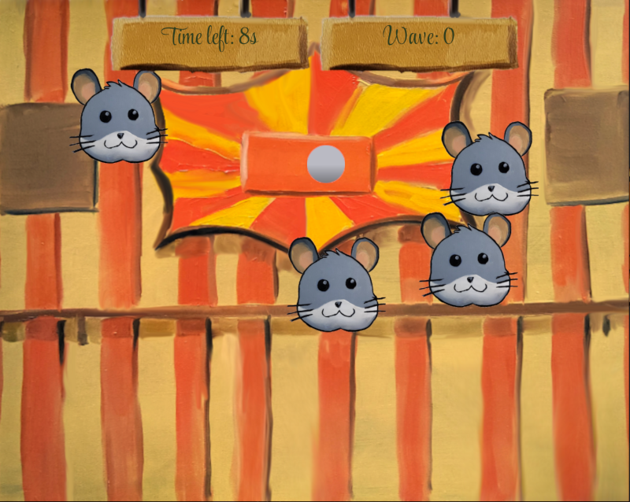
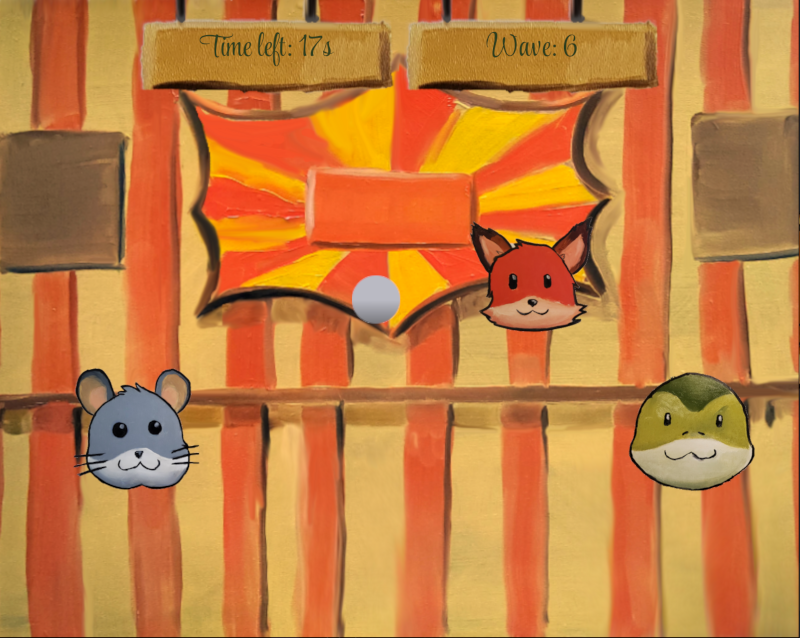

# Animal Arcade

**Animal Arcade** is a fast-paced, vintage-style shooting gallery where you take aim at a menagerie of mischievous animals! Use your mouse or touch screen to blast foxes, snakes, and hedgehogs as they dance and dart across the screen. Each wave brings new challenges, so sharpen your aim and test your reflexes! Can you become the ultimate animal arcade champion?

This game was created during the [Ludum Dare 56](https://ldjam.com/events/ludum-dare/56).

## Template

We started from the bevy 2D template: https://github.com/TheBevyFlock/bevy_new_2d

There are many parts of the code and potentially left over assets left from them.

## Run your game

Running your game locally is very simple:

- Use `cargo run` to run a native dev build.
- Use [`trunk serve`](https://trunkrs.dev/) to run a web dev build.

If you're using [VS Code](https://code.visualstudio.com/), this template comes with a [`.vscode/tasks.json`](./.vscode/tasks.json) file.

  
Run release builds

- Use `cargo run --profile release-native --no-default-features` to run a native release build.
- Use `trunk serve --release --no-default-features` to run a web release build.

  
Linux dependencies

If you are using Linux, make sure you take a look at Bevy's [Linux dependencies](https://github.com/bevyengine/bevy/blob/main/docs/linux_dependencies.md).
Note that this template enables Wayland support, which requires additional dependencies as detailed in the link above.
Wayland is activated by using the `bevy/wayland` feature in the [`Cargo.toml`](./Cargo.toml).

## License

The source code in this repository is licensed under MIT license:

- [MIT License](./LICENSE)

[Assets](./assets) created by the team (@vilmarzti) are available under [CC BY-SA 4.0](https://creativecommons.org/licenses/by-sa/4.0/).

Some [assets](./assets) are 3rd-party. See the [credits screen](./src/screens/credits.rs) for more information.
